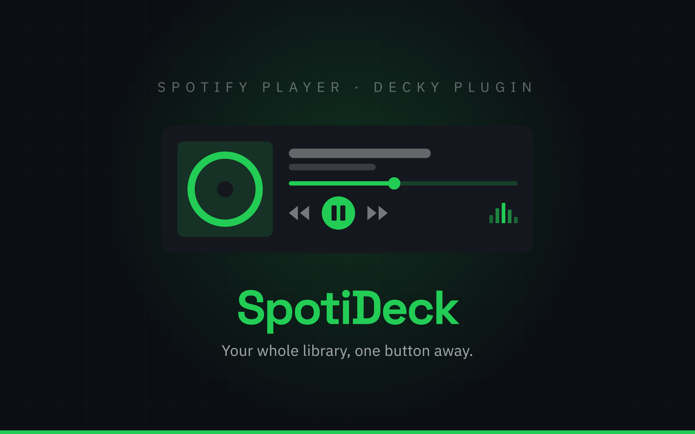

<div align="center">

<h1>SpotiDeck</h1>



[](CHANGELOG.md)
[](#requirements)
[](https://decky.xyz)
[](LICENSE)

**Your Spotify library and game audio balance in one Steam overlay.**
Play your music, browse playlists and adjust the mix without leaving Gaming Mode.

[Features](#features) · [Requirements](#requirements) · [Installation](#installation) · [Spotify setup](#spotify-setup) · [Usage](#usage) · [How it works](#how-it-works) · [Troubleshooting](#troubleshooting)

</div>

---

## Features

| | |
|---|---|
| **Compact Spotify player** | Album artwork, track position, previous/play-pause/next and Spotify-style sliders inside QAM |
| **Your music library** | Browse playlists, Liked Songs and saved albums, with track lists and playlist playback |
| **Artists and podcasts** | Followed artists, albums and singles, saved shows and episodes, podcast search and resume positions |
| **Quick access** | Pin up to 12 collections, revisit recently played tracks and your top tracks/artists, and reuse recent searches |
| **Search and queue** | Find songs, albums and playlists; add tracks to the queue without interrupting playback |
| **Playlist editing** | Create playlists, add tracks or episodes, remove unique items and move items in playlists you can edit |
| **Playback options** | Shuffle, repeat and save the current track to Liked Songs |
| **Sleep timer** | Pause after 1–240 minutes, including while QAM is closed |
| **Phone sign-in** | A locally generated QR code connects a phone on the same network directly to the handheld |
| **Playback devices** | Automatically select SpotiDeck at startup; switch to another available Spotify Connect device when needed |
| **Separate audio controls** | Adjust Spotify and all other handheld audio independently |
| **Game / Spotify balance** | One slider with both sources at full volume in the centre; moving either way lowers only the opposite source |
| **Controller navigation** | Native Decky controls with A to select, B to return and X to queue supported track rows |
| **Local playback** | Optional Spotify Soloist player keeps music playing when QAM closes or a game starts |
| **Live player state** | Local Soloist events update playback state; bounded reconnect and process recovery handle interruptions |
| **Startup recovery** | Retry a previously paired player that started before the network was ready, without automatically playing music |
| **Saved preferences** | Retains the volume mode and balance position across plugin restarts |

---

## Requirements

| Requirement | Details |
|---|---|
| System | SteamOS with [Decky Loader](https://decky.xyz) and a working desktop audio session |
| Tested handheld | Lenovo Legion Go 2 on **SteamOS 3.10** and **Decky Loader 3.2.8** |
| Spotify account | Spotify Premium and an internet connection |
| Account connection | Your own Spotify Web API app **Client ID** |
| Local playback | Your own **Spotify Soloist API key**; the plugin installer supports Linux x86_64 and AArch64 |
| Other audio / Balance | PipeWire with `pw-dump` and `pw-cli`; Balance also requires a Spotify device with remote volume control |

The player and mixer have been exercised in the real Legion Go 2 QAM. The device owner
confirmed A/B/D-pad navigation and audible game/Spotify balance during gameplay.

---

## Installation

1. Install [Decky Loader](https://decky.xyz) if it is not already installed.
2. Use a locally built plugin ZIP, or build one from the source directory below.
3. In Gaming Mode, open **Quick Access Menu → Decky → Settings → Developer**.
4. Choose **Install Plugin from ZIP** and select the archive.
5. Open the plugin and complete [Spotify setup](#spotify-setup).

The package is `artifacts/SpotiDeck-1.0.0.zip`, containing one `SpotiDeck`
folder. Open **SpotiDeck** in the Decky menu after installation.

For an existing installation of the earlier alpha named Spotify, use the
[development deployment helper](#development) to migrate its account settings and local
player data. Installing the ZIP alongside the old plugin would leave two copies.

<details>
<summary><b>Building from source</b></summary>

<br>

Requires Node.js 20+ and Python 3.10+. Clone the repository and build the plugin:

```bash
git clone https://github.com/Rayekkk/SpotiDeck.git
cd SpotiDeck
npm ci
npm run build
npm run package
```

Run **build before package**. Packaging uses the existing frontend build and creates the
ZIP under `artifacts/`. Install that archive through Decky; a checkout containing
`node_modules` is not an installation package.

The ZIP includes plugin source and dependency notices. Credentials, preview fixtures,
Python caches and the Soloist executable are excluded.

</details>

---

## Spotify setup

There are two separate credentials:

| Credential | What it enables |
|---|---|
| **Web API Client ID** | Account sign-in, library browsing, search and playback controls |
| **Soloist API key** | Playing Spotify audio directly on the handheld |

Each user supplies their own credentials. The Soloist key is only needed for local
playback; SpotiDeck can also control an existing Spotify Connect device.

### Connect your account

1. Open the [Spotify developer dashboard](https://developer.spotify.com/dashboard) and choose **Create app** with Web API access.
2. Add this exact redirect URI: `http://127.0.0.1:43891/callback`.
3. Add the Spotify account you will use to the app's user allowlist if required.
4. In the plugin, open **Connect Spotify**, or **More → Settings** if already connected.
5. Paste the app's **Client ID**, select **Connect to Spotify**, and finish signing in through Spotify's browser page.

No Client Secret is used. Your Spotify password is entered on Spotify's own sign-in page.
With the default setup, complete sign-in in a browser on the handheld: the callback points
to that device. A browser on another computer needs the SSH forwarding option below.
After updating from an earlier alpha, reconnect once when Settings asks for updated
permissions. Existing playback remains available while new library permissions are pending.

### Sign in by phone

1. Connect the phone and handheld to the same trusted Wi-Fi network.
2. In **Settings**, choose phone sign-in. Add the exact HTTPS redirect shown there to
   the redirect list of your Spotify developer app; retain the existing loopback redirect.
3. Scan the QR code. The handheld uses its own local certificate, so the browser will
   ask you to trust it on first use. The certificate fingerprint is available in Settings.
4. Choose **Continue to Spotify** on the phone and approve access. Spotify returns directly
   to the handheld; no external relay receives the authorization.

The listener is open only during a five-minute sign-in attempt and closes on completion,
cancellation or unload. Phone sign-in requires `openssl` on the handheld. If the handheld's
LAN IP changes, update the HTTPS redirect shown in Settings. Account tokens stay on the
handheld; QR generation is local. Phone sign-in does not replace the Client ID or Soloist key.

### Play on the handheld

1. In **Settings → Listen on this handheld**, choose **Install player from Spotify**.
2. Generate your personal key using [Spotify's Soloist authentication guide](https://developer.spotify.com/documentation/soloist/concepts/authentication).
3. Paste it into **Player key**, choose **Save key**, then **Start player**.
4. Open the Spotify app on the same local network and select **SpotiDeck** once to pair the local player.
5. Return to the plugin. SpotiDeck selects its local player automatically after pairing and on later startups.

The executable is downloaded separately from Spotify's servers. It is not included in
the plugin ZIP. Your Soloist key stays in the handheld's private settings.

<details>
<summary><b>Optional sign-in from a Windows browser</b></summary>

<br>

Use a trusted SSH connection to forward the callback to the handheld. Replace the account
and hostname, then keep this command running while signing in:

```powershell
ssh -N -o StrictHostKeyChecking=yes -o ExitOnForwardFailure=yes -L 127.0.0.1:43891:127.0.0.1:43891 HANDHELD_USER@HANDHELD_HOST
```

Start **Connect to Spotify** in the installed plugin and open its newly generated
Spotify authorization URL in the Windows browser. Keep the tunnel open until the plugin
confirms the connection. Each sign-in attempt expires after five minutes.

The local UI mockup does not configure the handheld or complete its sign-in flow.

</details>

---

## Usage

The main page contains the current track, seek bar, playback buttons and audio sliders.
**Playlists**, **Search**, **Playback device** and **More** appear underneath.

| Control | Action |
|---|---|
| **A** | Select a menu item, open a collection or play a track |
| **B** | Return to the previous plugin page |
| **X** | Add a supported, focused track row to the queue |
| **D-pad** | Navigate native controls and adjust a focused slider |

Open **More** for shuffle, repeat, saving the current track, Queue, Saved albums and
Settings. Search runs when submitted and offers **Load more** for additional results.

**More → Your library** contains artists, podcasts, recent listening, personal top items
and pinned collections. Each collection or track has an options button for saving,
pinning or playlist actions. Selected playlist and album tracks retain their original
playback context. Starting from Liked Songs queues up to the next 100 available tracks.

Playlist edits check current access and revision before changing anything. Removing one
occurrence of a duplicated track is blocked because the documented API removes by URI;
use Spotify to remove that particular occurrence. Browsing contents of playlists you do
not own or collaborate on remains limited by Spotify's development-mode API.

Set or cancel the **Sleep timer** under More. It continues while QAM is closed and is
cancelled when the account changes or the plugin unloads. It does not survive a reboot.

### Volume modes

Open **More → Settings → Volume sliders** and select **Separate** or **Balance**.

**Separate** is the default. **Music volume** controls the selected Spotify device.
**Other audio** controls the handheld's remaining playback streams, including games,
browsers and system sounds, while preserving their individual volume and mute settings.

**Balance** starts in the centre with **both sources at 100%**. Move left to lower only
Spotify; move right to lower only other audio. The labels show the resulting source
volumes, not a percentage split of one shared volume.

| Slider position | Other audio | Spotify |
|---|---|---|
| Fully left | 100% | 0% |
| Halfway from centre to left | 100% | 50% |
| **Centre** | **100%** | **100%** |
| Halfway from centre to right | 50% | 100% |
| Fully right | 0% | 100% |

Later selections reuse the saved balance position. Switching back to Separate keeps the
current levels. Spotify volume follows the selected Connect device; Other audio always
controls this handheld. For Other audio, 100% means no additional attenuation of the
application's own volume.

Closing QAM keeps music and the local mixer running. Unloading the plugin stops its
local player and restores the audio streams it still controls. Saved preferences remain
available on the next load.

---

## How it works

| Component | Role |
|---|---|
| **Decky interface** | React panel using native Steam focus groups, buttons, text inputs and sliders |
| **Spotify Web API** | OAuth PKCE sign-in, library data, search and playback commands |
| **Spotify Soloist** | Optional local audio engine exposed as a Spotify Connect device |
| **PipeWire mixer** | Temporary volume adjustments for playback streams other than Spotify |

The panel opens with local settings and available cached playback immediately. Spotify
profile, playback and saved balance updates run in the background, so a slow profile
request does not block the menus or an already available player. During startup the
visible panel checks progress about once per second, then returns to a 15-second interval.
Transient failures use a short retry delay; Spotify's longer rate limits are respected.

Accepted pause/resume, seek and volume commands update the panel immediately, with
protection against older status responses. Changes made in another Spotify app can take
until the next refresh to appear when controlling a remote Connect device. For the local
Soloist player, a private loopback WebSocket receives playback, position and queue events.
Library and search results are cached and paginated.

Selecting a playback device sends one command and shows **Connecting** until the
receiver confirms the change. The list refreshes automatically. If the current session
contains no music, a remote choice shows **Selected · Choose a song to play**; the next
explicit playback action targets that device without starting music merely to select it.

Other-audio adjustments leave the system output volume, microphones and Spotify streams
alone. New playback streams are picked up about once per second while attenuation is
active. Normal application volumes are not saved at the reduced level, so a game closed
while muted is not permanently remembered as muted by the plugin.

Tokens, the Soloist key and settings live outside the plugin's code directory, with
private file permissions and atomic saves. Signing out clears account credentials and
local-player pairing and stops local playback; the music cache may remain. Soloist's
startup arguments contain its key, so raw process listings should not be shared publicly.

---

## Troubleshooting

<details>
<summary><b>Sign-in does not finish, or Spotify rejects the account</b></summary>

<br>

Check the Client ID, the exact redirect URI and the account's access to your developer
app. Complete sign-in on the handheld or through the callback tunnel above. Start a new
attempt if the five-minute window has expired.

Spotify applies Premium and user-access limits to development-mode apps. See the
[official development-mode guide](https://developer.spotify.com/documentation/web-api/tutorials/february-2026-migration-guide)
for the current rules.

</details>

<details>
<summary><b>Nothing is playing, or the local device is missing</b></summary>

<br>

In Settings, check that the local player is installed, has a saved key and is running.
Pair it once through the Spotify app on the same network. SpotiDeck then selects it
automatically; **Playback device** also lets you choose it manually. An account
connection alone does not start music.

To replace a stopped or outdated Soloist build, stop the player, choose **Update player
from Spotify**, then start it again. Downloads come from
[Spotify's official build service](https://developer.spotify.com/documentation/soloist/reference/downloads-and-updates).

</details>

<details>
<summary><b>Other audio or Balance is unavailable</b></summary>

<br>

Other audio requires the handheld user's working PipeWire session, `pw-dump` and
`pw-cli`. Balance additionally needs an available Spotify device that supports remote
volume control. At the centre, both sources should read 100%.

The Other audio slider affects local playback streams, not another Connect device or the
hardware master volume. Apps that also manipulate PipeWire soft gains are outside the
verified configuration.

</details>

<details>
<summary><b>A playlist opens but its tracks cannot be loaded</b></summary>

<br>

Spotify can restrict playlist access for development-mode apps. The panel reports the
read error; try a playlist owned by your account. The playlist playback action remains
available when Spotify permits playback.

SpotiDeck supports music tracks, albums, playlists, artists and podcasts. Offline
downloads, lyrics, quality selection and the Spotify Home feed are not implemented.

</details>

---

## Development

```bash
npm ci
npm run typecheck
npm run test:ui
npm test
npm run build
npm run package
```

The backend suite uses isolated settings and mocked service/audio calls. Frontend tests
exercise navigation, pending requests, playback state and both volume modes. Live QAM
checks on the Legion Go 2 cover sign-in, library reads, transport, seeking and the balance
curve.

<details>
<summary><b>Interactive UI preview</b></summary>

<br>

Run `npm run dev` and open [the local preview](http://127.0.0.1:5173/). It renders the same
App component in an interactive Legion Go 2 mockup with a 16:10 screen. Use **Cały Legion**
or **Ekran 16:10** to change the view, and the mock controls or keyboard to navigate.

The preview uses fictional music and simulated playback. It does not play audio or
connect to your Spotify account. See [preview asset notes](preview/ASSETS.md).

</details>

<details>
<summary><b>Development deployment over SSH</b></summary>

<br>

The [deployment helper](scripts/deploy_live.py) targets the verified Legion Go 2 model
83N0 and its standard Decky layout. It requires Paramiko, the rebuilt ZIP and a verified
SSH host key:

```bash
python scripts/deploy_live.py --host HANDHELD_HOST
```

It stages outside Decky's plugin directory, stops the loader and its remaining workers,
installs atomically, and checks the live non-root backend. The previous plugin is retained
for rollback. When upgrading the earlier Spotify alpha, it also migrates the private
settings and player data to SpotiDeck, preserving sign-in, pairing and volume preferences.

</details>

---

## Credits

- [Decky Loader](https://github.com/SteamDeckHomebrew/decky-loader) and [Decky UI](https://github.com/SteamDeckHomebrew/decky-frontend-lib) - the plugin platform and native controls
- [Spotify Web API](https://developer.spotify.com/documentation/web-api) and [Spotify Soloist](https://developer.spotify.com/documentation/soloist) - account access, playback control and the local audio engine
- [decky-apple-music](https://github.com/BrielleG116/decky-apple-music) - the original interaction reference for a service-inspired Decky interface

Built by Rayek. SpotiDeck is an independent implementation and is not affiliated with
or endorsed by Spotify AB.

---

## License

MIT - see [LICENSE](LICENSE). Bundled dependency notices and source information are listed
in [NOTICE](NOTICE). Spotify Soloist is downloaded separately and remains subject to
Spotify's terms.

---

<div align="left">

*Vibe coded with AI assistance 🤖*

</div>
